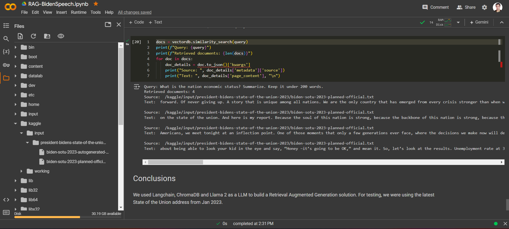

# Retrieval-Augmented Generation (RAG) based President Biden's Speech 2023

  

## Dataset

The dataset used in this project can be found on Kaggle: [President Biden Speech Dataset](https://www.kaggle.com/datasets/whegedusich/president-bidens-state-of-the-union-2023/data).

## Objective

The goal is to develop a Q&A system capable of delivering informed responses on the content of President Biden's address, demonstrating RAG's application in combining semantic data retrieval with generative language models for NLP analysis in political discourse.

## Key Components

- **Llama 2.0**: Employs for generating text responses that mimic human conversation.
- **ChromaDB**: Acts as a vector database for storing and retrieving speech data semantically.
- **LangChain**: Orchestrates the interaction between Llama 2.0 and ChromaDB, facilitating the RAG process.

## Functionality

The system retrieves information from ChromaDB based on user queries about the SOTU address, then uses Llama 2.0 to generate responses. This ensures accuracy and broader contextual understanding, resulting in precise and enriched answers.

  

## Use Case

Ideal for researchers, journalists, educators, and the public for exploring political speeches via natural language queries. It showcases how retrieval and generation can be integrated in NLP to improve information access and understanding.

## Run

To get started with this project:

1. Clone this repository to your local machine.
2. Ensure you have Jupyter Notebook installed and running.
3. Install the required dependencies.
4. Download the "President Biden Speech Dataset" and place it in the designated directory.
5. Open and run the Jupyter Notebook "RAG-BidenSpeech.ipynb" to train and evaluate the model.

Alternatively you can use Google Collaboratory to run this notebook.

## Contributing

We welcome contributions to enhance the functionality and efficiency of this script. Feel free to fork, modify, and make pull requests to this repository. To contribute:

1. Fork the Project.
2. Create your Feature Branch (`git checkout -b feature/AmazingFeature`).
3. Commit your Changes (`git commit -m 'Add some AmazingFeature'`).
4. Push to the Branch (`git push origin feature/AmazingFeature`).
5. Open a Pull Request against the `main` branch.

## Results

We used Langchain, ChromaDB and Llama 2 as a LLM to build a Retrieval Augmented Generation solution. Here I have tested a query:

>"What is the nation economic status? Summarize. Keep it under 200 words."

The answer to this query is shown below:

## License

This project is under MIT license:

